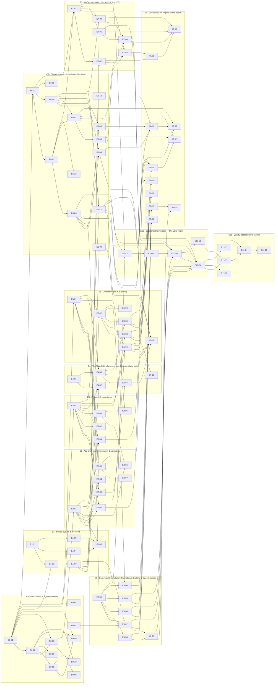

# Issue dependency graph

Generated by `python3 scripts/create-issues.py --graph`. Regenerate after editing epics.

```mermaid
flowchart LR
  subgraph E0["E0 · Foundations & agent guardrails"]
    E0_01["E0-01"]
    E0_02["E0-02"]
    E0_03["E0-03"]
    E0_04["E0-04"]
    E0_05["E0-05"]
    E0_06["E0-06"]
    E0_07["E0-07"]
    E0_08["E0-08"]
    E0_09["E0-09"]
    E0_10["E0-10"]
  end
  subgraph E1["E1 · Design system & the world"]
    E1_01["E1-01"]
    E1_02["E1-02"]
    E1_03["E1-03"]
    E1_04["E1-04"]
    E1_05["E1-05"]
    E1_06["E1-06"]
  end
  subgraph E2["E2 · App shell, journey overview & navigation"]
    E2_01["E2-01"]
    E2_02["E2-02"]
    E2_03["E2-03"]
    E2_04["E2-04"]
    E2_05["E2-05"]
    E2_06["E2-06"]
    E2_07["E2-07"]
  end
  subgraph E3["E3 · Progress & persistence"]
    E3_01["E3-01"]
    E3_02["E3-02"]
    E3_03["E3-03"]
    E3_04["E3-04"]
    E3_05["E3-05"]
  end
  subgraph E4["E4 · The Threshold: placement quiz & personalized path"]
    E4_01["E4-01"]
    E4_02["E4-02"]
    E4_03["E4-03"]
    E4_04["E4-04"]
    E4_05["E4-05"]
  end
  subgraph E5["E5 · Content engine & authoring"]
    E5_01["E5-01"]
    E5_02["E5-02"]
    E5_03["E5-03"]
    E5_04["E5-04"]
    E5_05["E5-05"]
    E5_06["E5-06"]
    E5_07["E5-07"]
  end
  subgraph E6["E6 · Cluster simulator & the kubectl terminal"]
    E6_01["E6-01"]
    E6_02["E6-02"]
    E6_03["E6-03"]
    E6_04["E6-04"]
    E6_05["E6-05"]
    E6_06["E6-06"]
    E6_07["E6-07"]
    E6_08["E6-08"]
    E6_09["E6-09"]
    E6_10["E6-10"]
    E6_11["E6-11"]
    E6_12["E6-12"]
    E6_13["E6-13"]
  end
  subgraph E7["E7 · GitOps simulation: GitLab CI & Argo CD"]
    E7_01["E7-01"]
    E7_02["E7-02"]
    E7_03["E7-03"]
    E7_04["E7-04"]
    E7_05["E7-05"]
    E7_06["E7-06"]
  end
  subgraph E8["E8 · Observability simulation: Prometheus, Grafana & OpenTelemetry"]
    E8_01["E8-01"]
    E8_02["E8-02"]
    E8_03["E8-03"]
    E8_04["E8-04"]
    E8_05["E8-05"]
    E8_06["E8-06"]
    E8_07["E8-07"]
  end
  subgraph E9["E9 · Curriculum: the regions of the Reach"]
    E9_01["E9-01"]
    E9_02["E9-02"]
    E9_03["E9-03"]
    E9_04["E9-04"]
    E9_05["E9-05"]
    E9_06["E9-06"]
    E9_07["E9-07"]
    E9_08["E9-08"]
    E9_09["E9-09"]
    E9_10["E9-10"]
    E9_11["E9-11"]
  end
  subgraph E10["E10 · Capstone: Stormwatch — "The Long Night""]
    E10_01["E10-01"]
    E10_02["E10-02"]
    E10_03["E10-03"]
    E10_04["E10-04"]
    E10_05["E10-05"]
  end
  subgraph E11["E11 · Quality, accessibility & launch"]
    E11_01["E11-01"]
    E11_02["E11-02"]
    E11_03["E11-03"]
    E11_04["E11-04"]
    E11_05["E11-05"]
  end
  E0_01 --> E0_02
  E0_01 --> E0_03
  E0_02 --> E0_03
  E0_02 --> E0_05
  E0_02 --> E0_06
  E0_03 --> E0_08
  E0_01 --> E0_09
  E0_02 --> E0_09
  E0_05 --> E0_09
  E0_02 --> E0_10
  E0_05 --> E0_10
  E0_01 --> E1_02
  E1_01 --> E1_02
  E1_02 --> E1_03
  E1_01 --> E1_04
  E1_01 --> E1_05
  E1_04 --> E1_06
  E1_05 --> E1_06
  E2_01 --> E1_06
  E0_03 --> E2_01
  E2_01 --> E2_02
  E3_01 --> E2_02
  E2_01 --> E2_03
  E3_01 --> E2_03
  E5_01 --> E2_03
  E2_01 --> E2_04
  E5_01 --> E2_04
  E5_01 --> E2_05
  E3_03 --> E2_06
  E2_01 --> E2_06
  E2_05 --> E2_07
  E0_01 --> E3_01
  E3_01 --> E3_02
  E3_01 --> E3_03
  E3_01 --> E3_04
  E2_01 --> E3_04
  E3_03 --> E3_05
  E5_01 --> E3_05
  E4_01 --> E4_02
  E3_01 --> E4_02
  E2_01 --> E4_02
  E4_01 --> E4_03
  E5_01 --> E4_03
  E4_03 --> E4_04
  E2_03 --> E4_04
  E4_03 --> E4_05
  E5_03 --> E4_05
  E0_01 --> E5_01
  E5_01 --> E5_02
  E1_03 --> E5_02
  E5_02 --> E5_03
  E3_01 --> E5_03
  E5_02 --> E5_04
  E3_01 --> E5_04
  E2_01 --> E5_04
  E5_02 --> E5_05
  E4_03 --> E5_05
  E5_02 --> E5_06
  E5_04 --> E5_07
  E6_09 --> E5_07
  E6_10 --> E5_07
  E4_04 --> E5_07
  E2_02 --> E5_07
  E3_04 --> E5_07
  E0_01 --> E6_01
  E6_01 --> E6_02
  E6_02 --> E6_03
  E6_01 --> E6_04
  E6_04 --> E6_05
  E6_03 --> E6_05
  E6_04 --> E6_06
  E6_03 --> E6_06
  E6_04 --> E6_07
  E6_02 --> E6_07
  E6_07 --> E6_08
  E1_03 --> E6_09
  E6_01 --> E6_10
  E6_04 --> E6_10
  E3_01 --> E6_10
  E6_01 --> E6_11
  E6_04 --> E6_12
  E6_02 --> E6_13
  E6_01 --> E7_01
  E6_02 --> E7_01
  E7_01 --> E7_02
  E1_03 --> E7_02
  E7_01 --> E7_03
  E7_02 --> E7_03
  E6_08 --> E7_03
  E7_01 --> E7_04
  E6_04 --> E7_04
  E7_01 --> E7_05
  E1_03 --> E7_05
  E7_04 --> E7_06
  E7_05 --> E7_06
  E6_07 --> E7_06
  E6_03 --> E8_01
  E8_01 --> E8_02
  E1_03 --> E8_02
  E0_07 --> E8_02
  E8_01 --> E8_03
  E8_01 --> E8_04
  E8_01 --> E8_05
  E5_02 --> E8_06
  E8_01 --> E8_06
  E8_02 --> E8_07
  E8_03 --> E8_07
  E5_04 --> E9_01
  E5_05 --> E9_01
  E5_03 --> E9_01
  E2_05 --> E9_01
  E5_04 --> E9_02
  E5_05 --> E9_02
  E5_03 --> E9_02
  E5_04 --> E9_03
  E5_05 --> E9_03
  E6_05 --> E9_03
  E6_10 --> E9_03
  E9_03 --> E9_04
  E6_07 --> E9_04
  E6_08 --> E9_04
  E6_05 --> E9_05
  E6_06 --> E9_05
  E6_12 --> E9_05
  E6_10 --> E9_05
  E9_05 --> E9_06
  E6_03 --> E9_06
  E6_07 --> E9_06
  E7_02 --> E9_07
  E7_03 --> E9_07
  E7_04 --> E9_08
  E7_05 --> E9_08
  E7_06 --> E9_08
  E9_07 --> E9_08
  E8_02 --> E9_09
  E8_03 --> E9_09
  E8_04 --> E9_10
  E8_05 --> E9_10
  E8_06 --> E9_10
  E8_07 --> E9_11
  E9_10 --> E9_11
  E6_03 --> E10_01
  E7_01 --> E10_01
  E8_01 --> E10_01
  E10_01 --> E10_02
  E10_02 --> E10_03
  E6_10 --> E10_03
  E7_06 --> E10_03
  E8_07 --> E10_03
  E10_03 --> E10_04
  E6_09 --> E10_04
  E7_05 --> E10_04
  E8_02 --> E10_04
  E8_04 --> E10_04
  E8_05 --> E10_04
  E10_03 --> E10_05
  E10_04 --> E11_01
  E10_05 --> E11_01
  E10_04 --> E11_02
  E10_04 --> E11_03
  E10_05 --> E11_04
  E11_01 --> E11_04
  E11_04 --> E11_05
```
